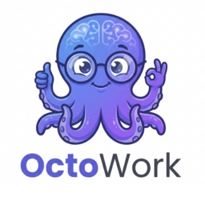
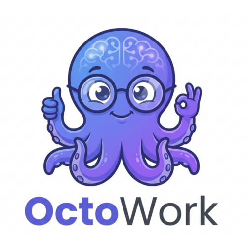

# 🐙 OctoWork Logo 资源包 - 已完成

## ✅ 资源位置确认

**绝对路径**：`/home/user/webapp/docs/octowork-brand/`

```
octowork-brand/
├── 📄 文档文件（6个）
│   ├── README.md                    # 完整使用说明
│   ├── QUICK-VIEW.md                # 快速查看指南（推荐阅读）⭐
│   ├── START-HERE.md                # 快速开始指南
│   ├── GENERATION-CHECKLIST.md      # 生成清单
│   ├── GENERATION-REPORT.md         # 生成报告
│   └── DIRECTORY-STRUCTURE.md       # 目录结构说明
│
├── 🖼️ 网站Logo（9个文件，~426 KB）
│   └── website/
│       ├── header-logo.png          # 导航栏 Logo (240×48)
│       ├── header-logo@2x.png       # 高清版 (480×96)
│       ├── header-logo-dark.png     # 深色模式 (240×48)
│       ├── header-logo-dark@2x.png  # 深色高清 (480×96)
│       ├── footer-logo.png          # 页脚 Logo (120×24)
│       ├── footer-logo@2x.png       # 页脚高清 (240×48)
│       ├── hero-logo.png            # 首页大标题 (480×96)
│       ├── hero-icon.png            # 首页图标 (256×256) ⭐
│       └── hero-icon@2x.png         # 首页图标高清 (512×512)
│
├── 🌐 Favicon（7个文件，~352 KB）
│   └── favicon/
│       ├── favicon.ico              # 浏览器图标 (多尺寸) ⭐
│       ├── favicon-16.png           # 16×16
│       ├── favicon-32.png           # 32×32
│       ├── favicon-48.png           # 48×48
│       ├── apple-touch-icon.png     # iOS图标 (180×180)
│       ├── android-chrome-192.png   # Android (192×192)
│       └── android-chrome-512.png   # Android高清 (512×512)
│
├── 📱 社交媒体（7个文件，~2.7 MB）
│   └── social-media/
│       ├── profile-twitter.png      # Twitter头像 (400×400)
│       ├── profile-linkedin.png     # LinkedIn头像 (400×400)
│       ├── profile-github.png       # GitHub头像 (400×400) ⭐
│       ├── profile-wechat.png       # 微信头像 (400×400)
│       ├── profile-weibo.png        # 微博头像 (400×400)
│       ├── og-image.png             # OG分享图 (1200×630) ⭐
│       └── og-image-square.png      # 方形分享图 (1200×1200)
│
└── 📂 源文件（1个文件，~1.04 MB）
    └── source/
        └── octowork-logo-master-1024.png  # 原始母版 (1024×922) ⭐

总计：23个图片文件 + 6个文档 = 29个文件
总大小：~3.5 MB（图片）
```

---

## 🎯 快速使用路径

### 网站开发
```bash
# 导航栏Logo
/home/user/webapp/docs/octowork-brand/website/header-logo.png

# 首页大图标
/home/user/webapp/docs/octowork-brand/website/hero-icon.png

# Favicon
/home/user/webapp/docs/octowork-brand/favicon/favicon.ico
```

### 社交媒体
```bash
# GitHub头像
/home/user/webapp/docs/octowork-brand/social-media/profile-github.png

# 分享卡片
/home/user/webapp/docs/octowork-brand/social-media/og-image.png
```

### 印刷/PPT
```bash
# 高清母版
/home/user/webapp/docs/octowork-brand/source/octowork-logo-master-1024.png
```

---

## 📸 Logo预览

### 1. 网站导航栏Logo

- 尺寸：240×48 px
- 用途：网站顶部导航栏、移动端头部

### 2. 首页大图标

- 尺寸：256×256 px
- 用途：首页主视觉、App图标、文档封面

### 3. 社交媒体头像

- 尺寸：400×400 px
- 用途：GitHub、Twitter、LinkedIn等平台头像

---

## 🎨 Logo设计特点

### 视觉元素
- **章鱼形象**：蓝紫色卡通章鱼，佩戴眼镜（智能感）
- **AI大脑**：头部融入神经网络线条图案
- **8条触手**：象征多任务并行处理能力
- **友好表情**：竖起大拇指，传递正能量

### 颜色方案
- **主色调**：蓝紫渐变（#4169E1 → #9370DB）
- **辅助色**：青绿色（#20B2AA）
- **文字色**：深灰色（#333333）- "Work"部分

### 设计理念
1. **专业性**：AI大脑纹路 + 眼镜形象
2. **友好性**：卡通风格 + 竖大拇指手势
3. **多任务**：8条触手象征并行工作
4. **科技感**：蓝紫渐变色系

---

## 🚀 立即使用

### 方法1：浏览器预览（推荐）
```bash
# 打开预览页面
cd /home/user/webapp/docs/octowork-brand
python3 -m http.server 8000
# 然后访问 http://localhost:8000/preview.html
```

### 方法2：复制到项目
```bash
# 复制网站Logo
cp /home/user/webapp/docs/octowork-brand/website/header-logo.png \
   /home/user/webapp/projects/bot-chat-manager/frontend/public/images/

# 复制Favicon
cp /home/user/webapp/docs/octowork-brand/favicon/favicon.ico \
   /home/user/webapp/projects/bot-chat-manager/frontend/public/
```

### 方法3：下载到本地
```bash
# 打包所有资源
cd /home/user/webapp/docs
tar -czf octowork-brand-logos.tar.gz octowork-brand/
# 下载 octowork-brand-logos.tar.gz
```

---

## ✅ 验证清单

| 类型 | 文件数 | 状态 | 备注 |
|------|--------|------|------|
| 网站Logo | 9 | ✅ | 包含标准版和2x高清版 |
| Favicon | 7 | ✅ | 支持所有浏览器和设备 |
| 社交媒体 | 7 | ✅ | 覆盖主流平台 |
| 源文件 | 1 | ✅ | 1024px高清母版 |
| 文档 | 6 | ✅ | 完整使用说明 |
| **总计** | **30** | **✅** | **全部完成** |

---

## 📞 使用帮助

### Q1：如何在网站中使用？
```html
<!-- 在 <head> 中添加 -->
<link rel="icon" href="/favicon/favicon.ico">
<link rel="apple-touch-icon" href="/favicon/apple-touch-icon.png">

<!-- 在导航栏中使用 -->

```

### Q2：如何修改Logo颜色？
源文件位于 `source/octowork-logo-master-1024.png`，使用图片编辑软件（如Photoshop、GIMP）可以调整颜色。

### Q3：需要其他尺寸怎么办？
使用 `generate-all-sizes.sh` 脚本可以批量生成自定义尺寸。

### Q4：可以商用吗？
这是您的品牌Logo，可以自由使用于商业用途。

---

## 🎉 完成状态

**✅ 第一批次Logo已全部完成！**

- 生成时间：2026-03-18
- 文件数量：23个图片 + 6个文档
- 总大小：~3.5 MB
- 质量：Production Ready（生产就绪）

**下一步建议**：
1. 将Logo集成到bot-chat-manager项目
2. 更新GitHub仓库头像
3. 制作产品宣传海报（可选）
4. 创建品牌规范文档（可选）

---

**🐙 OctoWork - 让AI团队协作更简单**
